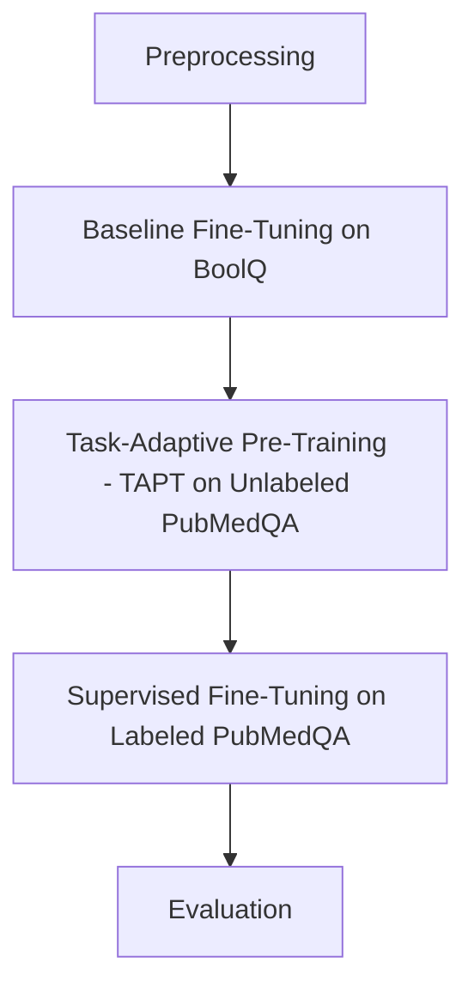

# Enhancing Biomedical QA through Task-Adaptive Pretraining: A Transfer Learning Approach

## Project Overview
This project explores **transfer learning and Task-Adaptive Pre-Training (TAPT)** to enhance the performance of general-purpose language models on biomedical question answering tasks. Specifically, we adapt models originally trained on the **BoolQ** dataset (general yes/no questions) to the **PubMedQA** dataset (biomedical yes/no questions) to improve domain-specific reasoning and accuracy.

## Motivation
General-purpose language models often underperform in specialized fields like healthcare, where domain-specific language and contextual understanding are critical. Annotated biomedical datasets are scarce and expensive to produce. This project investigates how **TAPT** can bridge the domain gap using unlabeled biomedical text, minimizing reliance on large labeled datasets while improving real-world applicability in clinical and research settings.

## Datasets

- **Source Domain**: [BoolQ (Boolean Questions Dataset)](https://github.com/google-research-datasets/boolean-questions)
  - A natural language understanding dataset containing short yes/no questions based on a given passage.
  - Extracted from real-world web data (Wikipedia passages).
  - Contains **9,427 training examples**, each consisting of:
    - A question
    - A passage (context paragraph)
    - A yes/no answer
  - Purpose: To train models for general yes/no question answering over diverse, open-domain text.

- **Target Domain**: [PubMedQA (Biomedical Question Answering Dataset)](https://pubmedqa.github.io/)
  - Designed for machine reading comprehension and question answering in the biomedical field.
  - Based on abstracts from PubMed research papers, focusing on factual yes/no/maybe clinical research questions.
  - Two subsets were used:
    - **Labeled Subset** (`ori_pqal.json`):
      - 1,000+ biomedical questions paired with short passages and annotated answers (Yes/No/Maybe).
      - Used for supervised fine-tuning.
      - \"Maybe\" answers were mapped to \"No\" for binary classification consistency.
    - **Unlabeled Subset** (`ori_pqaa.json`):
      - 5,000+ biomedical questions with passages, but without ground-truth labels.
      - Used for **Task-Adaptive Pre-Training (TAPT)** to adapt models to biomedical language before fine-tuning.
  - Purpose: To evaluate and adapt models to specialized biomedical knowledge and clinical reasoning tasks.

## Methodology

### 1. Preprocessing
- **BoolQ**:
  - Loaded the BoolQ dataset containing yes/no questions from general English text.
  - Prepared inputs as question-passage pairs for binary classification fine-tuning.
- **PubMedQA**:
  - Combined labeled (`ori_pqal.json`) and a subset of unlabeled (`ori_pqaa.json`) data.
  - Converted answers into binary format: \"yes\" = 1, \"no\" = 0, and \"maybe\" treated as \"no\" for binary classification.
  - Formatted the dataset into standardized question-passage pairs.
  - Created train and development (dev) splits for supervised fine-tuning.

### 2. Baseline Fine-Tuning on Source Task
- **Models Used**: BERT, DistilBERT, RoBERTa (from HuggingFace Transformers).
- Fine-tuned each model on the **BoolQ** dataset to build a strong foundation in general yes/no question answering.
- Objective: Enable models to learn general reasoning skills over diverse textual inputs.

### 3. Task-Adaptive Pre-Training (TAPT)
- Conducted TAPT by continuing masked language modeling on **unlabeled PubMedQA passages**.
- TAPT datasets: 6K, 10K, and 15K samples.
- Purpose: Adapt models to the biomedical domain by familiarizing them with medical vocabulary, syntax, and discourse structures without supervised labels.

### 4. Fine-Tuning
- After TAPT, models were fine-tuned on **labeled PubMedQA** examples.
- Task: Predict yes/no answers based on biomedical research passages.
- Special handling: \"Maybe\" answers were merged with \"No\" to maintain binary consistency.

### 5. Evaluation
- Models were evaluated on the PubMedQA development set.
- Metrics:
  - **Accuracy**: Overall proportion of correct predictions.
  - **F1 Score**: Harmonic mean of precision and recall, essential for handling minor class imbalance.
## Workflow

## Results

| Model                      | Accuracy | F1 Score |
|-----------------------------|----------|----------|
| BERT (BoolQ)                | 71.53%   | 78.93%   |
| DistilBERT (BoolQ)          | 70.73%   | 77.35%   |
| RoBERTa (BoolQ)             | 78.35%   | 82.61%   |
| RoBERTa (→ PubMedQA)        | 84.42%   | 91.31%   |
| TAPT-6K + Fine-Tuning       | 84.83%   | 91.79%   |
| TAPT-10K + Fine-Tuning      | **89.83%** | **94.08%** |
| TAPT-15K + Fine-Tuning      | 87.92%   | 92.96%   |

- Fine-tuning RoBERTa on PubMedQA significantly improved performance compared to baseline training on BoolQ.
- TAPT with 10K samples provided the best balance between sample size and performance improvement.

## Conclusion
This project demonstrates that **Task-Adaptive Pre-Training (TAPT)** is an effective strategy to enhance the domain transferability of general-purpose QA models to the biomedical domain. By adapting RoBERTa using unlabeled PubMedQA passages before fine-tuning, we achieved significant gains in accuracy and F1 score on the biomedical QA task.
